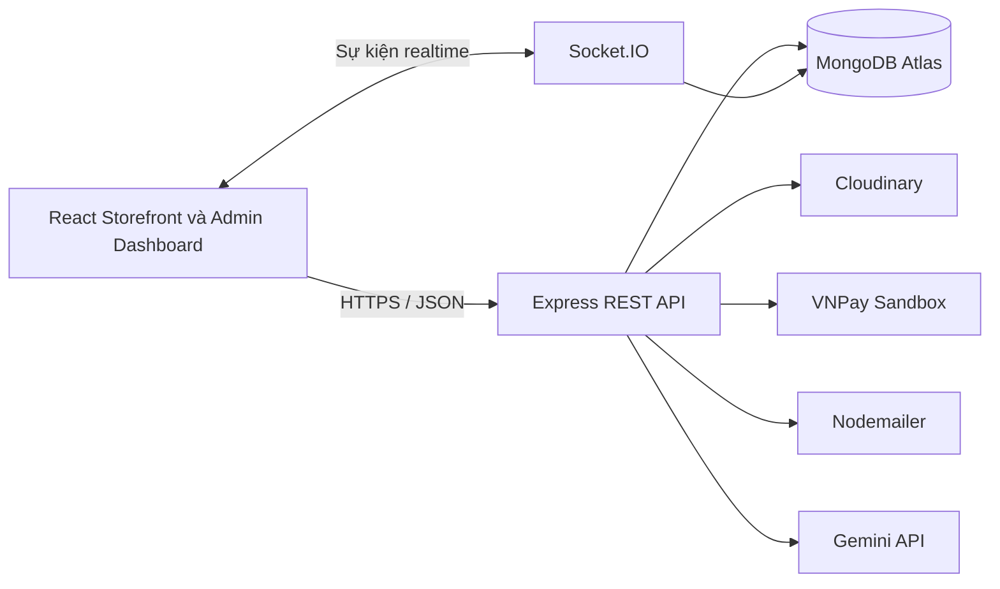

# D.E Fashion — Hệ thống thương mại điện tử và quản trị

Ứng dụng thương mại điện tử thời trang full-stack, hỗ trợ khách hàng xem sản phẩm, quản lý giỏ hàng, đặt hàng, thanh toán thử nghiệm và cho phép nhân viên vận hành cửa hàng thông qua trang quản trị có phân quyền.

Dự án còn cung cấp hai kênh trò chuyện độc lập: trợ lý mua sắm AI sử dụng Gemini Function Calling và kênh hỗ trợ trực tiếp giữa khách hàng với quản trị viên theo thời gian thực.

## Ứng dụng trực tuyến

- **Frontend:** [https://de-store.pages.dev](https://de-store.pages.dev)
- **Backend API:** [https://fashion-shop-project.onrender.com](https://fashion-shop-project.onrender.com)
- **Mã nguồn:** [https://github.com/PhamLuongBaoThien/fashion-shop-project](https://github.com/PhamLuongBaoThien/fashion-shop-project)

> Thanh toán VNPay hiện chạy trong môi trường sandbox. Trợ lý Gemini có thể tạm ngừng phản hồi khi API miễn phí hết quota.

## Điểm nổi bật

- Backend nguyên khối phân lớp với 60 REST API routes.
- Xác thực bằng JWT access token và refresh token lưu trong HTTP-only cookie.
- Năm phạm vi phân quyền RBAC: sản phẩm, danh mục, đơn hàng, người dùng và hệ thống.
- Hỗ trợ khách vãng lai và thành viên đặt hàng bằng COD hoặc VNPay Sandbox.
- Sử dụng MongoDB transaction để đồng bộ việc trừ kho, tạo đơn hàng và xóa giỏ hàng.
- Quản lý tồn kho theo size và tự động gộp giỏ hàng khách vào tài khoản sau khi đăng nhập.
- Chat hỗ trợ khách hàng–quản trị viên bằng Socket.IO với kết nối được xác thực bằng JWT.
- Gemini Function Calling truy xuất sản phẩm và chính sách thật từ MongoDB.
- Xuất báo cáo sản phẩm, người dùng và đơn hàng sang Excel.
- Dashboard thống kê doanh thu, đơn hàng, tồn kho và khách hàng.

## Chức năng

### Cửa hàng dành cho khách hàng

- Xem danh sách, bộ sưu tập và sản phẩm liên quan.
- Tìm kiếm, lọc, sắp xếp và phân trang sản phẩm bằng URL query parameters có thể chia sẻ.
- Xem giá khuyến mãi, size còn hàng, số lượng tồn kho và chi tiết sản phẩm.
- Thêm sản phẩm vào giỏ hàng được lưu cục bộ mà không cần đăng nhập.
- Tự động gộp giỏ hàng khách vào giỏ hàng tài khoản sau khi xác thực.
- Đặt hàng với tư cách khách vãng lai hoặc thành viên.
- Thanh toán khi nhận hàng hoặc qua VNPay Sandbox.
- Xem lịch sử và chi tiết đơn hàng.
- Cập nhật hồ sơ, địa chỉ, ảnh đại diện và mật khẩu.
- Khôi phục mật khẩu qua email.
- Xem các chính sách đã công bố về giao hàng, đổi trả, thanh toán, bảo mật và điều khoản.

### Trang quản trị

- Quản lý sản phẩm, danh mục, khách hàng, vai trò và đơn hàng.
- Theo dõi doanh thu và số đơn theo năm hoặc theo tháng.
- Theo dõi đơn chờ xử lý, đơn gần đây và sản phẩm hết hàng.
- Xuất dữ liệu sản phẩm, khách hàng và đơn hàng sang Excel.
- Tạo, chỉnh sửa, công bố hoặc ẩn chính sách cửa hàng.
- Khóa tài khoản khách hàng và kiểm soát quyền quản trị bằng RBAC.
- Xem danh sách hỗ trợ và trả lời khách hàng theo thời gian thực.

### Trợ lý AI và hỗ trợ khách hàng

Mỗi khách hàng đã đăng nhập có một cuộc trò chuyện AI và một cuộc trò chuyện hỗ trợ lâu dài. Hai lịch sử được hiển thị ở hai tab riêng và vẫn được giữ nguyên sau khi tải lại trang.

Với mỗi câu hỏi tự do, trợ lý chỉ sử dụng một Gemini API request để chọn một trong các tool sau:

- `search_products`: tìm sản phẩm đang hoạt động và còn hàng theo từ khóa, danh mục, size, mức giá, độ mới và cách sắp xếp.
- `get_policy`: lấy chính sách đã công bố từ MongoDB.
- `request_support`: hướng dẫn khách hàng chuyển sang tab nhân viên hỗ trợ.

Backend kiểm tra toàn bộ tham số tool, truy vấn cơ sở dữ liệu và tự định dạng câu trả lời cuối cùng. Mỗi phản hồi hiển thị tối đa ba card sản phẩm tham chiếu trực tiếp đến catalog, nhờ đó tên, giá, hình ảnh và tình trạng sản phẩm luôn theo dữ liệu hiện tại.

Tin nhắn được ghi qua HTTP API, còn Socket.IO chỉ nhận cập nhật theo thời gian thực. Kết nối Socket được xác thực bằng JWT và server tự phân phòng thay vì tin room ID do client gửi. Khi khách gửi tin cho nhân viên, mười tin nhắn AI gần nhất được đính kèm làm ngữ cảnh cho quản trị viên.

## Kiến trúc

Ứng dụng sử dụng kiến trúc client–server với backend Node.js nguyên khối được tổ chức theo từng lớp.



Backend tách trách nhiệm thành routes, controllers, services, models, middleware, configuration và Socket.IO manager. Frontend được tổ chức thành pages, components tái sử dụng, API services, Redux state, hooks và routing.

## Công nghệ sử dụng

| Thành phần | Công nghệ |
| --- | --- |
| Frontend | React 19, JavaScript, React Router, Redux Toolkit, Redux Persist, TanStack Query |
| Giao diện | Ant Design, Styled Components, Framer Motion, Recharts |
| Backend | Node.js 20, Express 5, REST APIs, Socket.IO |
| Cơ sở dữ liệu | MongoDB Atlas, Mongoose |
| Xác thực | JWT, refresh token, HTTP-only cookie, bcrypt, RBAC |
| Tích hợp | Gemini API, Cloudinary, VNPay Sandbox, Nodemailer |
| Báo cáo | SheetJS/xlsx, jsPDF, html2canvas |
| Triển khai | Cloudflare Pages, Render |

## Cấu trúc dự án

```text
fashion-shop-project/
├── backend/
│   ├── src/
│   │   ├── config/       # Cloudinary, cookie và upload
│   │   ├── controllers/  # Tiếp nhận và xử lý HTTP request
│   │   ├── middleware/   # Xác thực, khóa tài khoản và RBAC
│   │   ├── models/       # Mongoose schemas
│   │   ├── routes/       # REST endpoints
│   │   ├── scripts/      # Script tạo dữ liệu chính sách
│   │   ├── services/     # Nghiệp vụ và tích hợp bên thứ ba
│   │   ├── socket/       # Thiết lập Socket.IO có xác thực
│   │   └── index.js      # Điểm khởi chạy backend
│   └── package.json
├── frontend/
│   ├── public/
│   ├── src/
│   │   ├── assets/
│   │   ├── components/
│   │   ├── context/
│   │   ├── hooks/
│   │   ├── pages/
│   │   ├── redux/
│   │   ├── routes/
│   │   └── services/
│   └── package.json
└── README.md
```

## Chạy dự án trên máy cá nhân

### Yêu cầu

- Node.js 20 trở lên
- npm
- MongoDB Atlas cluster
- Tài khoản Cloudinary để lưu hình ảnh
- Gmail App Password để gửi email
- Không bắt buộc: tài khoản VNPay Sandbox và Gemini API key

### 1. Tải mã nguồn

```bash
git clone https://github.com/PhamLuongBaoThien/fashion-shop-project.git
cd fashion-shop-project
```

### 2. Cấu hình và chạy backend

```bash
cd backend
npm install
```

Tạo file `backend/.env`:

```env
PORT=3001
NODE_ENV=development

MONGO_USER=your_mongodb_username
MONGO_PASSWORD=your_mongodb_password
MONGO_CLUSTER=your_cluster.mongodb.net

ACCESS_TOKEN=your_long_random_access_token_secret
REFRESH_TOKEN=your_long_random_refresh_token_secret

FE_URL_LOCAL=http://localhost:3000
FE_URL_PROD=https://your-project.pages.dev

CLOUDINARY_NAME=your_cloudinary_cloud_name
CLOUDINARY_API_KEY=your_cloudinary_api_key
CLOUDINARY_API_SECRET=your_cloudinary_api_secret

MAIL_ACCOUNT=your_email@gmail.com
MAIL_PASSWORD=your_gmail_app_password

VNP_TMN_CODE=your_vnpay_terminal_code
VNP_HASH_SECRET=your_vnpay_hash_secret
VNP_RETURN_URL=http://localhost:3000/order-success

GEMINI_API_KEY=your_gemini_api_key
GEMINI_MODEL=gemini-2.5-flash
```

Khởi chạy backend ở chế độ phát triển:

```bash
npm run dev
```

REST API và Socket.IO server sẽ chạy tại `http://localhost:3001`.

### 3. Tạo dữ liệu chính sách mặc định (không bắt buộc)

Script chỉ thêm những loại chính sách còn thiếu và không ghi đè nội dung mà quản trị viên đã chỉnh sửa.

```bash
npm run seed:policies
```

Cơ sở dữ liệu phải có sẵn một tài khoản với `isAdmin: true` vì script sử dụng tài khoản đó làm người cập nhật chính sách.

### 4. Cấu hình và chạy frontend

Mở terminal khác:

```bash
cd frontend
npm install
```

Tạo file `frontend/.env`:

```env
REACT_APP_API_KEY=http://localhost:3001/api
REACT_APP_API_URL=http://localhost:3001
REACT_APP_ADMIN_MAIL=your_super_admin_email@example.com
```

Khởi chạy React development server:

```bash
npm start
```

Truy cập [http://localhost:3000](http://localhost:3000).

## Tổng quan API

| Base path | Chức năng | Quyền truy cập |
| --- | --- | --- |
| `/api/user` | Đăng ký, xác thực, hồ sơ, khôi phục mật khẩu và người dùng | Công khai / xác thực / admin |
| `/api/product` | Catalog và quản lý sản phẩm | Công khai / RBAC |
| `/api/category` | Danh mục | Công khai / RBAC |
| `/api/cart` | Giỏ hàng tài khoản và gộp giỏ hàng khách | Khách hàng |
| `/api/orders` | Thanh toán, lịch sử và quản lý đơn hàng | Công khai / khách hàng / RBAC |
| `/api/payment` | Tạo URL, xử lý return và IPN của VNPay | Callback công khai |
| `/api/role` | Vai trò và quyền quản trị | Admin / RBAC |
| `/api/chat` | Chat AI, hỗ trợ, trạng thái đã đọc và phản hồi admin | Khách hàng / admin |
| `/api/dashboard` | Thống kê doanh thu và vận hành | Admin |
| `/api/policy` | Chính sách công khai và quản lý chính sách | Công khai / admin |

Backend lấy danh tính và vai trò người dùng từ JWT. API chat không nhận danh tính người gửi hoặc người nhận do client tự khai báo.

## Triển khai production

### Backend trên Render

- **Root directory:** `backend`
- **Build command:** `npm install`
- **Start command:** `npm start`
- **Runtime:** Node.js 20 trở lên
- Đặt `NODE_ENV=production`.
- Đặt `FE_URL_PROD` bằng đúng URL Cloudflare Pages và không thêm dấu `/` ở cuối.
- Khai báo đầy đủ biến môi trường và secret cần thiết ở phần cấu hình backend.

### Frontend trên Cloudflare Pages

- **Root directory:** `frontend`
- **Build command:** `CI=false npm run build`
- **Build output directory:** `build`
- **Production branch:** `main`

Các biến môi trường production:

```env
REACT_APP_API_KEY=https://your-render-service.onrender.com/api
REACT_APP_API_URL=https://your-render-service.onrender.com
REACT_APP_ADMIN_MAIL=your_super_admin_email@example.com
```

Sau khi thay đổi biến môi trường frontend, cần kích hoạt deployment mới trên Cloudflare Pages. CORS của backend phải chứa cùng frontend origin thông qua `FE_URL_PROD`.

## Các lệnh có sẵn

Backend:

```bash
npm run dev           # Chạy bằng nodemon
npm start             # Chạy ở chế độ production
npm run seed:policies # Thêm các chính sách mặc định còn thiếu
```

Frontend:

```bash
npm start             # Chạy development server
npm run build         # Tạo production build
npm test              # Chạy React tests
```

## Lưu ý khi demo

- Người dùng phải đăng nhập để sử dụng cả chat AI và chat nhân viên.
- VNPay đang chạy ở chế độ sandbox, không phải môi trường thanh toán thật.
- Gemini áp dụng quota miễn phí theo từng Google Cloud project và model. Khi hết quota ngày, chatbot sẽ hiển thị thông báo dành riêng cho bản demo.
- Luồng hỗ trợ không sử dụng ticket, không phân công nhân viên và không đóng cuộc trò chuyện; mọi quản trị viên có quyền đều có thể phản hồi.
- Không được commit file môi trường hoặc thông tin xác thực production vào repository.

## Tác giả

Dự án cá nhân được phát triển bởi [PhamLuongBaoThien](https://github.com/PhamLuongBaoThien).
